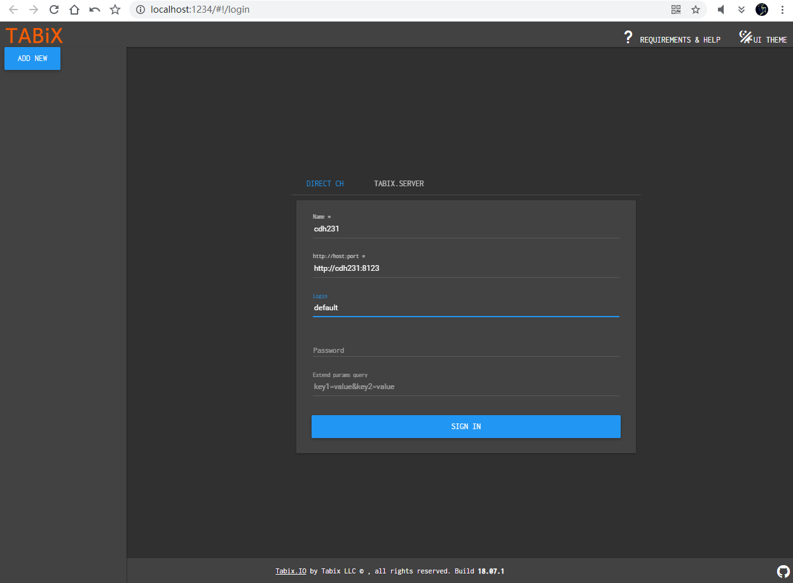
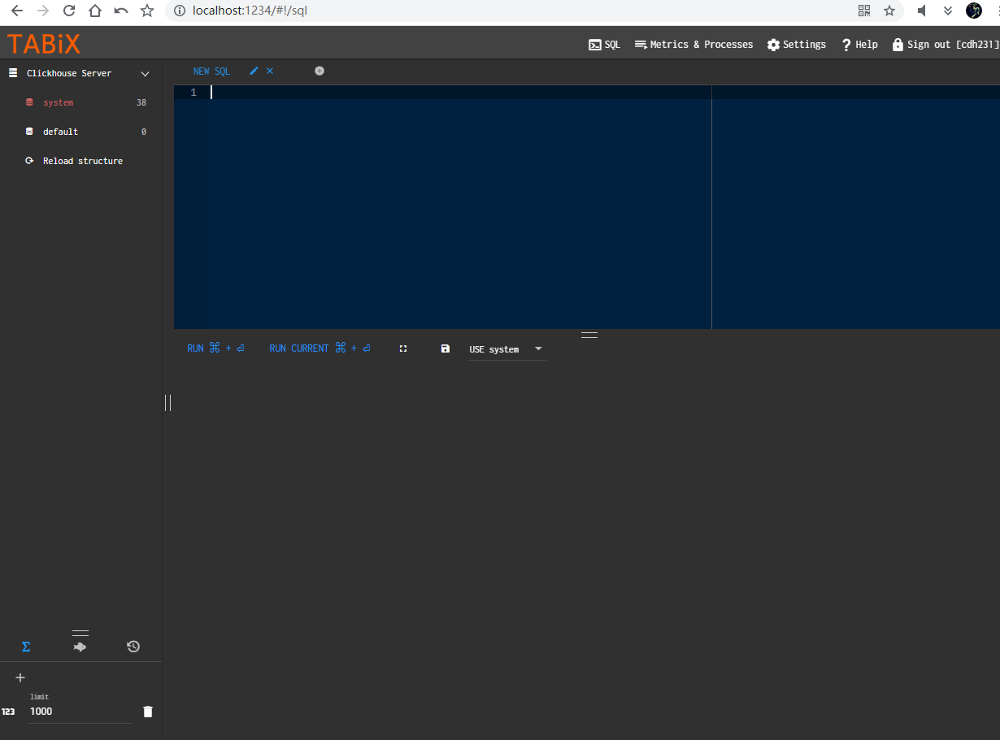
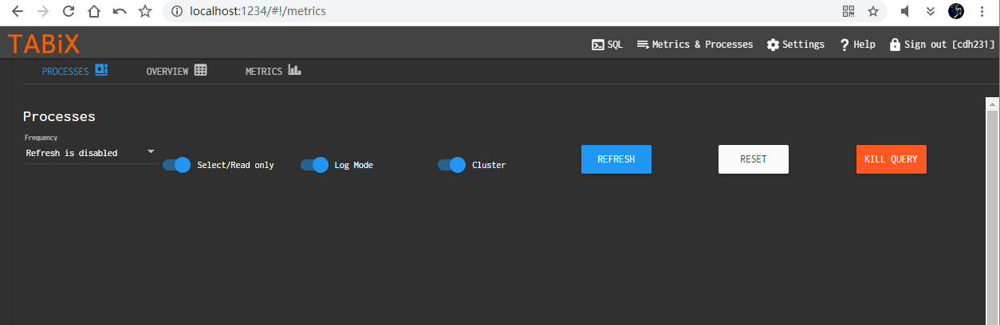
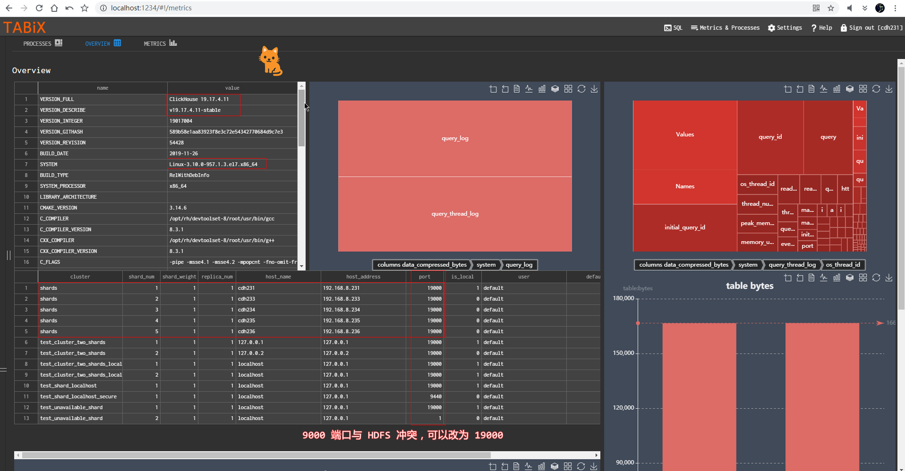
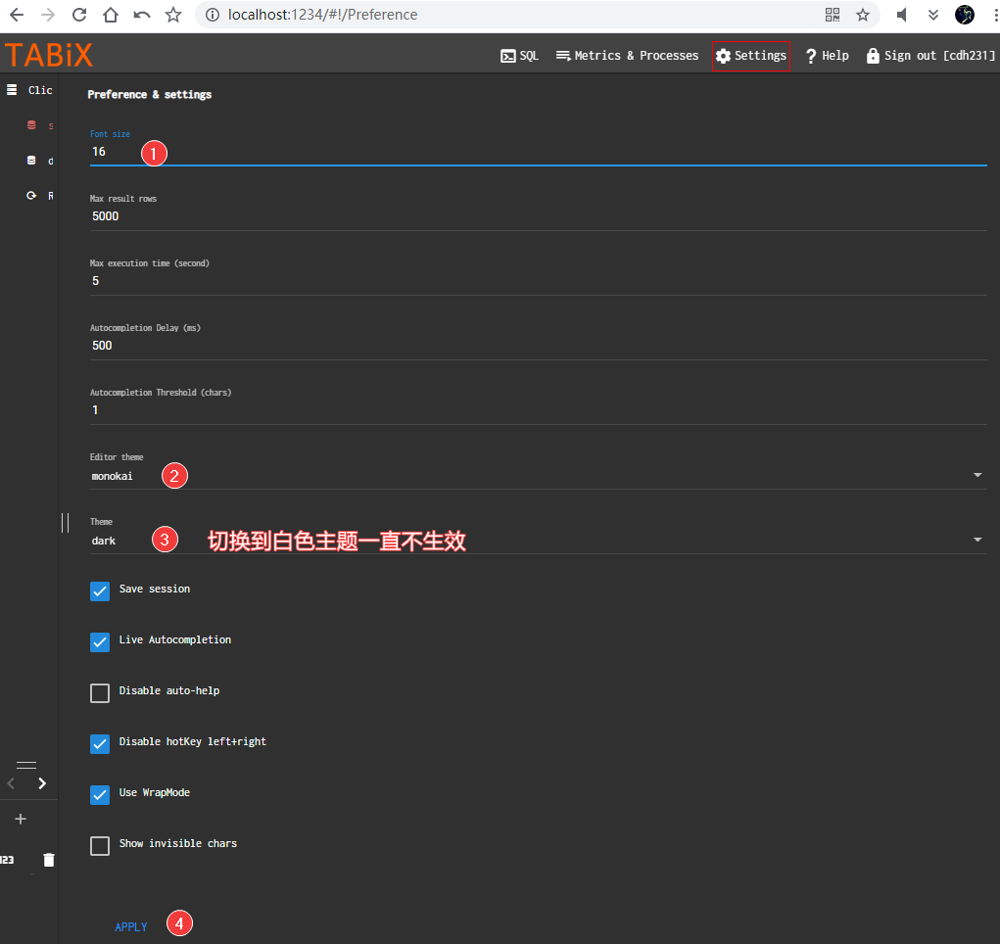

# Clickhouse 云托管静态WEB监控服务

Tabix 用于操作和监控 Clickhouse 数据库，ch 优先推荐的产品，可以部署在github pages 云托管，免安装。

---

# 本地简单调试+实时预览：
切换到 build 路径  
cmd> `http-server -a localhost -p 1234 -o`

# 预览：  
  
  
  
  
  

---

# 想要自托管方式：

[Install to you host](https://tabix.io/doc/Install/)
